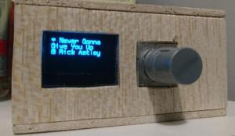
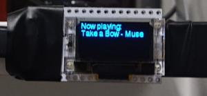

# Hardware-based remote controller for Mopidy server

## Raspberry Pi prototype

**See [subproject](./raspizero) for more information.**

## ESP32-based minimalistic device

**See [subproject](./esp32) for more information.**
