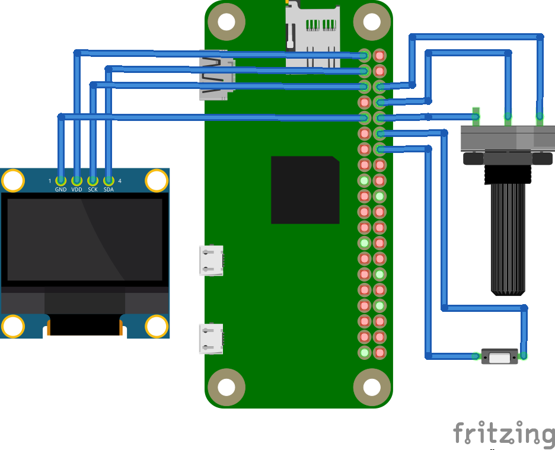

# mopidy-hw-remote
Hardware-based remote controller for Mopidy instance

## Base platform
* WeMOS D1 Mini -- target device
* NodeMCU (4MB version) -- prototyping 
* Raspberry Pi Zero W -- development

## Input
* EVE-PDBRL408B encoder with switch (mechanical, infinite rotation, incremental/quadrature output)

## Output
* SSD1306 display (monochrome OLED, 128x64 pixels, I²C interface)

## Base software
* Micropython ESP8266 distribution for production use
* Standard Python 3.5.3 for development

## Python stack (RPi)
* RPi.GPIO
* requests

Considered:
* `smbus`module for serial driver in development
* [`luma.oled`](https://github.com/rm-hull/luma.oled/) display driver in development

## Micropython stack (ESP)
Considered:
* `urequests` module for HTTP requests
* `machine.I2C` module for serial driver
* `machine.Pin` module for reading input
* `ssd1306` display driver

## Design

### Development rig

