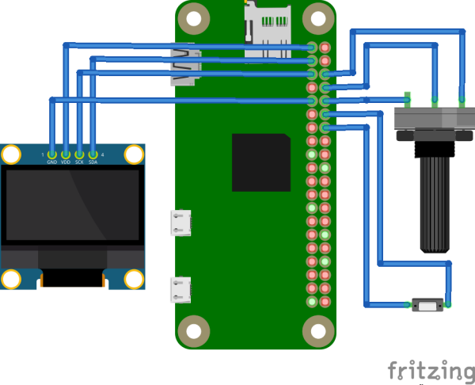
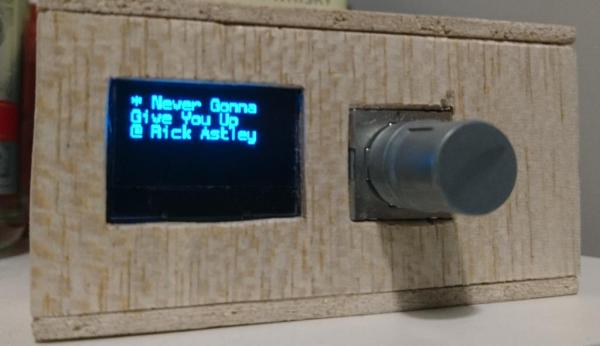

# Raspberry-Pi-based Mopidy controller prototype

## Schematics

## Built prototype

## Components

* Raspberry Pi Zero W board.
* SSD1306 OLED, I²C-based 128×64 display.
* EVE-PDBRL408B rotary encoder with switch.

## Software stack

* Python 3.6
